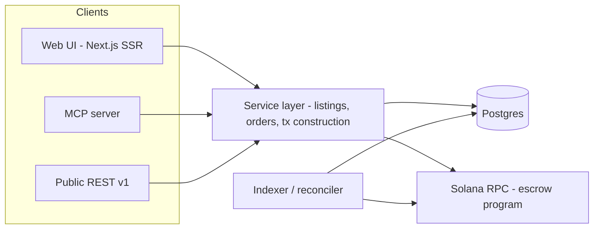

# Agent-Tickets — Design Document

**Date:** 2026-08-06 · **Status:** Final draft — all 12 research reports synthesized; pending user review · **Scope:** full product design + phased roadmap. The hackathon V1 scope is locked by the submitted PRD (`Agent-Tickets.md`); this document designs the system that V1 grows into, and corrects one V1 mechanism (§5.3) that is cheap to fix tonight and expensive to fix ever again.

---

## 1. Overview

Agent-Tickets is a peer-to-peer marketplace for buying and selling event tickets with funds held in non-custodial on-chain Solana escrow, where AI agents are first-class traders: everything a human can do on the website, an agent can do through a public REST API and an MCP server.

**Differentiators against incumbents (StubHub, Vivid Seats, SeatGeek, Ticketmaster resale):**

1. **Fees.** Retail all-in take at the big four runs ~25–40% (StubHub blends to ~20%: FY2024 GMV ≈ $8.7B on revenue ≈ $1.77B; brokers negotiate down, the retail long tail pays the headline). The honest competitive frontier is the proven low-fee tier — TickPick, Tixel, Twickets at ~10% — and our 3–5% undercuts even that, in a market where the FTC all-in pricing rule (2025) finally makes take rates comparable at the top of the search funnel.
2. **Payout trigger, not just payout speed.** Incumbents release seller money ~5–10 business days *after the event* — a ticket sold six months early is six months of seller float on a private balance sheet. Escrow release keys to *delivery*, collapsing months to hours, with the hold rule-bound and auditable instead of discretionary. The pitch: "you get paid when they get in, not weeks after the show."
3. **Agent-native.** Incumbents give professional brokers machine interfaces (Ticketmaster TradeDesk, Ticket Evolution) while consumers get captchas. A public REST + MCP surface for everyone is the wedge no incumbent will copy — their fee model depends on a human seeing a checkout page, and an agent comparison-shops on all-in price, structurally immune to drip pricing.

**Positioning that survives scrutiny:** not "cheaper StubHub" and not "NFT tickets" — the settlement and discovery layer for the P2P resale that already happens in DMs and group chats with no escrow at all: a market with large quantified fraud losses, no SafeTix dependency, no guarantee to match, and no incumbent to dislodge.

---

## 2. Strategic thesis (from the crypto-ticketing graveyard)

A decade of blockchain ticketing produced no durable consumer business. The research fleet's postmortem (r02) identifies why, and each finding is a design commitment here:

- **Primary issuance is contractually locked up** by venue exclusivity deals; every dead project (YellowHeart, SeatlabNFT, Relic) needed primary inventory and couldn't get it. **Resale-first is therefore the core strategic bet, not a scope compromise:** resale inventory is held by fans, and fans sign no exclusivity contracts. Native issuance (V2) is optional upside — the business must be viable without it.
- **The category leader was killed by its own token.** GET Protocol → OPEN Ticketing executed best-in-class for nine years (~5M cumulative tickets); its OPN token is down 99.2% with ~$1k daily volume, taxing its own integrators. **Agent-Tickets will never have a token. USDC-only settlement is a moat**, simplifies regulatory posture, and makes agent price-reasoning deterministic.
- **Every dead consumer brand pointed the blockchain at the user.** The two survivors (OPEN, tokenproof — which is alive, contrary to common belief) hide or minimize it. **Humans see dollars and "you can't get scammed"; agents see raw escrow state.** Same system, two truthful surfaces.
- **Coachella's "lifetime" NFT passes were bricked by FTX's bankruptcy** — on-chain asset, centralized chokepoint. **Our escrow must be non-custodial and independently exit-able:** release paths (confirm, timeout-release, timeout-refund) executable by anyone, working even if Agent-Tickets' servers are off. Publish the program + a minimal recovery script. This is the honest answer to "why blockchain at all" — the one property a Stripe-based competitor cannot match.
- **Nobody in the graveyard died of throughput or fees.** We justify Solana on USDC settlement quality, cheap program-controlled escrow, and deterministic finality — never on TPS.
- **Timing is materially different in 2026:** a federal jury found Live Nation/Ticketmaster illegally monopolized primary ticketing (2026-04-15; remedies TBD, appeals likely — hedge accordingly), and a Sept 2025 FTC suit alleges Live Nation colluded with brokers on resale. "The resale market is rigged by insiders" is now a court-documented claim; a neutral, programmatic venue is its antithesis.

---

## 3. Goals and non-goals

**Goals**
- Trust-minimized P2P trade: buyer's money is never with the seller until delivery is asserted and unchallenged, and never controlled by us at all — program logic, not admin keys, moves funds.
- One backend, three faces: human web UI, REST API, MCP server — identical capabilities and inventory state.
- A credible phased path from tonight's devnet MVP to real-money mainnet.

**Non-goals**
- No token, ever (see §2).
- No primary-onsale acquisition, ever — architecturally and in the terms (BOTS Act posture, §12).
- No custody of fiat, and no custodial float: fiat legs go through licensed partners (merchant-of-record onramps, payer-of-record off-ramps).
- Not a primary ticketer for major venues; native issuance targets the small-venue long tail where no incumbent contract exists.

---

## 4. Phased roadmap

**V1 — hackathon MVP (tonight, devnet; scope locked by PRD).** List (event/date/price USDC) → browse/search → buy locks USDC in escrow → seller marks delivered → buyer-confirm or post-delivery timeout releases; no-delivery timeout refunds (§5.3 correction — still within the PRD's listed features). MCP/API agent flow end-to-end. Mock tickets, wallet+USDC only, no disputes UI, no KYC, no fiat, no mobile.

**V1.5 — hardening (weeks 1–4).** Mainnet-beta with low limits and fee switch (3%). One-click buyer "not delivered" (`open_dispute`) freezing the clocks, platform-multisig arbiter. Seller reputation v0 (progressive limits). MCP OAuth 2.1 (§7.3). Privy embedded wallets + Kora gasless (§9). OFAC screening at API edge. Start Stripe onramp + Crossmint applications immediately (both are access-gated; the clock starts at application, not integration). **Inventory scoping (r01 + r08 reconciled):** first real money targets transferable mobile-transfer events ≥48h before doors — deliverable *and* verifiable at acceptance. Static-barcode PDFs are deliverable but duplicable (double-sell risk A2), so they wait for V2 bonds; will-call/ID-locked/non-transferable inventory is refused at listing time (per-event transferability metadata is a listing *precondition*, not a disclaimer); SafeTix/AXS account-bound stadium inventory out of scope until V3. Two protocol invariants ship with real money: **no listing without verified possession** (neutralizes the fastest-growing state ticket-law category, speculative-ticket bans) and **a signed provenance attestation on every listing** (the BOTS Act scienter defense). The demand story: the zero-escrow DM/group-chat market.

**V2 — native issuance + venue verification.** Organizers mint tickets as Metaplex Core assets through us (§10); resale of native tickets settles atomically (no confirmation window on that rail). One-phone door app with offline rotating-code verification. Anti-scalping presets. Agent delegation upgrades (§8): Turnkey/Privy policy-gated signers, `ApproveChecked` allowances delegated to the escrow program PDA. x402 metering on the public API.

**V3 — conventional-ticket resale at scale + mainstream.** The SafeTix gate: rotating-barcode tickets are account-bound licenses with no file to escrow; the only legitimate transfer is a platform-native account-to-account transfer we can't observe today. V3 attacks it with delivery attestation (transfer-confirmation verification, buyer account linking — via Solana Attestation Service issuers, §5.5) and seller bonds; plus card checkout, seller bank off-ramps, KYC thresholds, state-by-state gating. Until then, SafeTix inventory stays excluded rather than half-supported.

---

## 5. On-chain design: the escrow program

Anchor (v1.x — Anchor hit 1.0 and is at 1.1.2 as of June 2026; pin the exact version), devnet tonight → mainnet at V1.5. One program. The design rule, learned from Auction House's deprecation (r04): **mechanism in code, policy in config; get the account layout right on day one, because adding instructions later is free and changing layouts under live orders is not.**

### 5.1 Accounts

```rust
pub struct Config {                  // PDA ["config"]
    authority: Pubkey,
    arbiter: Pubkey,                 // V1: == authority, never invoked
    fee_bps: u16,                    // 0 tonight; 300 planned — fee taken at RELEASE, not lock
    fee_destination: Pubkey,
    usdc_mint: Pubkey,               // configurable: devnet mint tonight, real USDC later
    delivery_window_secs: i64,
    inspection_window_secs: i64,
    paused: bool,
    bump: u8,
    _reserved: [u8; 128],
}

pub struct Listing {                 // PDA ["listing", seller, listing_id.to_le_bytes()]
    seller: Pubkey,
    listing_id: u64,                 // CLIENT-generated nonce → precomputable, idempotent
    price: u64,                      // USDC base units (6dp) — in DATA, never in seeds
    event_hash: [u8; 32],            // hash(name|venue|start_ts)
    event_start_ts: i64,             // universal backstop deadline
    qty: u16,
    status: ListingStatus,           // Active | Locked | Settled | Cancelled
    delivery_commit: [u8; 32],       // reserved: commit-reveal of encrypted deliverable (zeroed V1)
    metadata_uri: [u8; 96],
    created_ts: i64,
    bump: u8,
    _reserved: [u8; 96],
}

pub struct Order {                   // PDA ["order", listing, buyer]
    listing: Pubkey,
    buyer: Pubkey,
    seller: Pubkey,
    amount: u64,
    fee_bps: u16,                    // snapshotted at lock
    state: OrderState,               // Locked | Delivered | Released | Refunded | Disputed | ArbiterResolved
    locked_ts: i64,
    delivery_deadline: i64,          // seller must mark_delivered by this, else buyer refundable
    inspection_deadline: i64,        // set at mark_delivered; buyer must confirm/dispute by this
    arbiter: Pubkey,                 // snapshotted from Config — live orders become disputable retroactively
    attestation: Pubkey,             // Pubkey::default() V1; SAS attestation account later
    bump: u8,
    _reserved: [u8; 96],
}
```

Escrow vault: a USDC ATA **owned by the Order PDA** (never a delegate on the buyer's ATA — delegates are revocable; a PDA-owned vault is not). `Disputed`/`ArbiterResolved` variants and the `arbiter`/`attestation` fields ship **tonight, dormant** — declaring enum variants late silently breaks exhaustively-matching clients, and reserved bytes + snapshotted pubkeys are the entire cost of making disputes a later instruction-add instead of a migration.

### 5.2 Instructions

1. `initialize_config(...)` — once.
2. `create_listing(listing_id, price, event_hash, event_start_ts, qty, metadata_uri)` — no funds move; structurally delegate-style listing (there is no on-chain asset to custody in V1 — the "asset" is someone else's PDF).
3. `cancel_listing` — seller, only while `Active`; closes account, rent back.
4. `lock_purchase` — the buy. `price` USDC buyer→vault; creates Order; `delivery_deadline = min(now + config.delivery_window_secs, event_start_ts − 2h)`. On-chain `status == Active` constraint makes double-buys fail atomically (API surfaces the loser as 409).
5. `mark_delivered` — **seller** asserts delivery; `Locked → Delivered`; sets `inspection_deadline = min(now + config.inspection_window_secs, event_start_ts + 6h)`.
6. `confirm_receipt` — buyer; from `Locked` or `Delivered` → `Released`; vault → seller minus fee, fee → `fee_destination`; close vault + order (rent back).
7. `timeout_release` — **permissionless**; requires `state == Delivered && now > inspection_deadline`. Pays seller.
8. `timeout_refund` — **permissionless**; requires (`state == Locked && now > delivery_deadline`) or (`now > event_start_ts` in any non-terminal state). Full refund, no fee.
9. `cancel_purchase` — seller-initiated (or co-signed) mutual unwind; defuses most would-be disputes before a dispute system exists.
10. *(V1.5, instruction-add only)* `open_dispute` / `arbiter_resolve` / `attested_release`.

Emit Anchor events from the first deploy (`ListingCreated`, `PurchaseLocked`, `Delivered`, `Released`, `Refunded`) — the indexer and agents consume events, never diff account state. Set `state` **before** the token-transfer CPI. No `init_if_needed` anywhere. Structural starting point: `solana-developers/program-examples` escrow (anchor variant) + `deanmlittle/anchor-escrow-2024`.

### 5.3 The two-clock correction (supersedes the single-timer reading of the PRD)

The locked PRD line "buyer-confirm releases escrow (or auto-releases after a timeout)" is **exploitable in both directions** if implemented as one timer: a seller who never delivers gets paid by buyer silence, and a silent buyer could otherwise grief an honest seller. The fix (r04) is two clocks separated by an explicit `mark_delivered`:

- Seller never asserts delivery → `delivery_deadline` passes → **buyer refunded**.
- Seller asserts delivery → `inspection_deadline` starts → buyer confirms, disputes (V1.5), or stays silent → silence past deadline → **seller paid**.

Timeout favors the seller *only after delivery is asserted*. This preserves every PRD feature and the demo script, costs one instruction and two timestamps tonight, and is very expensive to retrofit once real orders exist. `event_start_ts` clamps every window — tickets self-expire, a forcing function generic escrow lacks; any stale order hard-resolves there.

**Delivery has three real-world states, not one (r08):** `transfer_initiated → transfer_accepted → gate_scanned`. Ticketmaster documents one-click sender cancellation of a *pending* transfer — so "I sent it" proves nothing, and money must never release on initiation. Acceptance re-issues the barcode and voids the sender's — that is the correct proceeds-release trigger, and it's what `mark_delivered` + the V2 delivery oracle verify. Issuer rescission (stolen-card upstream purchases, account-takeover reversals) survives even acceptance, which no delivery oracle can fix — the answer is **split settlement** at V2: proceeds at verified acceptance, a seller bond held until shortly after event start. And design as if **every release goes to timeout**: a rational adversarial buyer never confirms, so the timeout path is the market's default settlement, not its fallback.

**Permissionless timeouts are an agent-marketplace requirement, not a detail:** if settlement needs our crank to be online, an agent counterparty is trusting our uptime. Anyone can push the state machine once a clock has run — and a bot that cranks expired escrows is the cheapest possible demonstration that agents are first-class participants.

### 5.4 What this is and isn't

This is **not** delivery-versus-payment. NFT marketplaces (Tensor, Magic Eden) settle asset and funds atomically in one instruction; our asset leg happens on Ticketmaster's servers, later. The relevant prior art is Escrow.com, eBay managed payments, and P2P crypto desks — which is why disputes, reputation, and seller bonds are *core roadmap*, not nice-to-haves. When a judge asks "what stops a seller taking the money?": tonight, the delivery-deadline refund plus reputation-to-come; V2+, bonds and attested delivery. The buyer confirmation is a human oracle and the trust bottleneck — the doc says so plainly rather than letting "escrow" imply more than it delivers.

### 5.5 Extension points already reserved

- **Attestation-gated release:** a platform (later third-party) SAS issuer attests "transfer completed for order X"; `attested_release` validates the attestation account by PDA re-derivation + issuer + expiry (no CPI — issuers stay swappable). Collapses the happy path from "buyer remembers to click" to automatic.
- **Seller bonds:** new `["bond", seller]` account, zero impact on Order layout; prices fraud rather than merely detecting it. Shared/margin escrow for bidders (Tensor's capital-efficiency pattern) is the first thing high-volume agents will ask for — the order model doesn't forbid it.
- **Commit-reveal delivery:** `delivery_commit` hash of the encrypted deliverable at listing time, key revealed on release — stops deliverable-swapping and gives disputes a verifiable artifact.

### 5.6 Devnet-tonight practicalities

Devnet USDC mint `4zMMC9srt5Ri5X14GAgXhaHii3GnPAEERYPJgZJDncDU` (in config, not a constant). All amounts in base units — the classic demo bug is a 10^6 mismatch between UI, API, and program. Absolute deadlines from `Clock`. Close accounts with `close =`. Pre-fund all demo wallets with SOL + devnet USDC before going on stage; never rely on faucets live. Throwaway upgrade authority tonight, and say the staging out loud when asked: throwaway → Squads 2-of-3 (private beta) → Squads + timelock (real money) → consider burning it once stable; verifiable builds (`solana-verify`) + Immunefi bounty before mainnet scale; audit ($20–60k, 1–3 weeks, booked 4–8 weeks out) before real money.

---

## 6. Off-chain architecture: one service layer, three faces



- **Domain core (tonight's most consequential structural decision):** every domain function lives in `packages/core` from the first commit, and every operation is defined once as a Zod schema that *generates* the OpenAPI 3.1 document, the typed REST handlers, and the MCP tool definitions. For a product whose thesis is "agents are first-class," drift between the agent surface and the human surface is a product defect — generation makes it impossible. Publish the OpenAPI doc; agents that don't speak MCP will codegen against it.
- **One write path, many read paths:** all mutations flow through the always-on API service (Hono on Railway/Fly from week 1; Next.js route handlers tonight) — the single place enforcing authorization, idempotency, **server-side spend caps**, per-principal-type rate limits, and an immutable audit row per agent mutation (principal, agent id, scopes, idempotency key, request hash, tx signature — the dispute-resolution artifact). It **constructs unsigned transactions**; the owner of funds signs (human wallet in browser, agent keypair client-side); it never relays caller-supplied prebuilt transactions (§8). Reads may go direct (server components → replica).
- **Web app:** Next.js 16 App Router on Vercel as the SSR/ISR + SEO shell with **no business logic on Vercel** (Fluid-compute economics punish long-lived/chatty workloads); event pages carry Schema.org `Event`/`Offer` JSON-LD (`availability`, `eventStatus`, `priceCurrency`) revalidated on-demand by the indexer. SEO surfaces and agent-discovery surfaces (`llms.txt`, public OpenAPI, `/.well-known/oauth-protected-resource`) are the same work item: make inventory legible to non-human readers — the acquisition strategy for a marketplace that can't outspend StubHub on ads.
- **Postgres + chain consistency:** `chain_events` keyed by signature with a monotonic commitment upsert (`processed < confirmed < finalized`), slot-guarded projections (`WHERE last_slot < incoming`), and the cursor committed in the same transaction — so gRPC, webhooks, and backfill run concurrently with exactly-once *effect*. **Commitment ladder, written down as a rule: render at `confirmed`; release funds, reveal deliverables, or pay out only at `finalized`.**
- **Indexing, three tiers (production):** Yellowstone/LaserStream gRPC primary (resume `from_slot`, ~20-minute replay window — a consumer crash becomes a non-event), Helius webhooks backup into the same idempotent ingest, RPC polling reconciler catching the bug you didn't anticipate. Tonight: write-through + a ~10s poll reconciler on devnet.
- **Holds:** a quote issues a Postgres hold row (`SELECT … FOR UPDATE SKIP LOCKED`, TTL 3–10 min, timer-released); the escrow init references the hold ID, so the chain can never settle a seat the off-chain system already gave away. This is also the listing-commitment answer to agent sniping — a quote binds for its TTL.
- **Realtime:** SSE over HTTP/2 from the always-on service (`Last-Event-ID` replay); agents are never forced to poll — Svix-signed outbound webhooks (HMAC + timestamp, replay-window enforced) plus `GET /events?since=<cursor>` catch-up.
- **Jobs:** graphile-worker for escrow/hold timers **enqueued in the same transaction as the state change** (a lost timer is a lost refund); Inngest for orchestration and fan-out. The timeout crank stays permissionless on-chain; ours is just the reliable instance.
- **Search:** Postgres FTS + `pg_trgm` + `unaccent`; graduate to Typesense at scale. Built as a projection off the same change stream, so it's rebuildable from scratch.
- **RPC:** Helius Developer $49 now (devnet gRPC included) → **Business $499 at mainnet** (the budget cliff — mainnet gRPC), QuickNode Build $49 as failover; never single-home RPC for a money app; staked connections for hot on-sales. **Cost at ~10k users: ~$200–300/mo pre-mainnet, ~$700–1,000/mo on mainnet.**
- **Observability:** OpenTelemetry with one trace ID from MCP tool call → REST → DB → tx signature → outbound webhook ("why did my order fail" is one trace). The SLIs no generic APM surfaces: `indexer_slot_lag` (page >150 slots), `mirror_drift_count` (page on sustained non-zero), `escrow_stuck_count`, `tx_land_rate`.
- **Testing:** LiteSVM TypeScript bindings + `anchor-litesvm` — same language as API/MCP, dramatically faster than `solana-test-validator`. Program tests: happy path, **both** timeout paths, cancel paths, double-buy rejection, fee math at 0 and 300 bps, event-start backstop. The demo script is the E2E rehearsal — run it twice before stage.
- **Migration path:** r12 §11 is a 16-row tonight→week-4 table (extract core → generated schemas → gRPC indexing → commitment ladder → holds → SSE → Svix → embedded wallets). Tonight's shortcuts are all listed with their replacement dates — nothing is discovered later.

---

## 7. The agent interface

### 7.1 MCP tools (namespaced `tickets.` — aggregating clients collide on generic names; keep the surface under ~10 tools)

| Tool | Args | Notes |
|---|---|---|
| `tickets.search_listings` | query?, event_name?, city?, date range?, max_price_usdc?, quantity?, cursor?, limit? | Read-only; `structuredContent` + `next_cursor`; cap ~20 results — agents pay for tokens |
| `tickets.get_listing` | listing_id | Detail incl. on-chain state, seller reputation, explorer link |
| `tickets.create_listing` | event fields, quantity, price_usdc, delivery_method, seller_payout_address | Returns listing_id |
| `tickets.cancel_listing` | listing_id | Only from `active` |
| `tickets.create_order` | listing_id, quantity, buyer_wallet, client_order_ref | **The handle-creating tool.** Returns opaque order_id, state, escrow_pda, amount, expires_at, payment instructions. Expiry policy stated in the tool description so the model sees it |
| `tickets.get_order` | order_id | Full state-machine object (§7.4) |
| `tickets.confirm_receipt` | order_id | The one irreversible tool — marked as such in its description |
| `tickets.cancel_order` | order_id, reason? | Pre-funding, or post-timeout refund path |
| `tickets.list_orders` | role, state?, cursor? | **Agents crash and restart** — this is how they resume |

Per the MCP spec: declare `outputSchema` on every tool and return conforming `structuredContent`; business failures ("listing already sold") are `isError: true` results **with a recovery hint and alternative listings**, never JSON-RPC errors — that's what lets the model self-correct; validate the caller's authorization against `order_id` on every call (a handle is a name, not a capability); deterministic `tools/list` ordering (prompt-cache friendly).

### 7.2 Standards posture (Aug 2026 reality)

There is no single agent-commerce standard to implement. **Do not implement ACP, AP2, or UCP in V1** — ACP compliance buys eligibility to apply for platform onboarding, not distribution, and Stripe's agent-side product is still waitlisted. Instead **mirror ACP's vocabulary** — `Idempotency-Key`/`Request-Id` headers echoed in responses, the session-vs-order status split, `order_created`/`order_updated` webhook names — so an "ACP-compatible adapter" is a later afternoon's work. AP2's Checkout Mandate / Payment Mandate pair (current naming — the 2025 "intent/cart mandate" terms are gone from the docs), now heading into FIDO standardization, is the credible long-term answer to "which human authorized this agent to spend $180" — cite as the V2 disputes direction. **Open item before this doc ships: check ucp.dev** — Stripe now frames seller choice as "UCP or ACP" and AP2 calls itself a UCP extension; the two-camp framing may be stale.

Publish to the **MCP Registry with DNS-verified namespace** on day one (the only discovery channel with real agent-side consumption; costs a TXT record). `llms.txt`: 15 minutes, no more — no evidence of inference-time consumption. Front with Cloudflare and add the WAF rule allowing `cf.bot_management.verified_bot` (Web Bot Auth) — the signing burden is entirely on the agent side; welcoming verified agents costs one rule.

**Browser-agent basics (the human UI is also an agent surface):** SSR with deep-linkable `/listing/{id}`, real `<button>`/`<a>` elements with accessible names, `data-testid` on every control, no walls on read paths (robots.txt allows `/events`, `/listings`; no CAPTCHA on GETs), and a documented exit from DOM to API: JSON-LD + `<link rel="alternate" type="application/json">` + a comment naming the MCP endpoint. An agent that can discover the MCP server from the page it's scraping stops scraping.

### 7.3 Auth: two tiers

- **Tier 1 (tonight): scoped API keys** (`listings:read`, `listings:write`, `orders:write`) issued from the web UI — what every real agent developer uses in week one.
- **Tier 2 (before real money): OAuth 2.1 per the MCP spec** — serve RFC 9728 protected-resource metadata at `/.well-known/oauth-protected-resource` (the one MUST), 401 + `WWW-Authenticate` with `resource_metadata` and `scope`, **validate token audience** against the canonical resource URI (RFC 8707 — the confused-deputy fix and the most-violated rule in shipped MCP servers), support Client ID Metadata Documents (Dynamic Client Registration is deprecated in the current draft — don't lead with `/register`), emit `iss` (RFC 9207).
- No request signing in V1 (ACP's `Signature`/`Timestamp` is the right merchant-to-platform answer later; canonicalization bugs are a classic time sink now).

### 7.4 Idempotency and order state

**Two idempotency layers, and the chain one is free:** (a) HTTP `Idempotency-Key` on every mutation — scoped `(api_key, endpoint, key)`, 24h retention, replay returns the stored response verbatim, same-key-different-body → 409, in-flight duplicate → 409; (b) **escrow PDA derived from `(listing, buyer, client_order_ref)`** — a retried buy tries to re-init an existing account, fails deterministically, and maps to "here is your existing order." Address derivation as idempotency survives our API server crashing mid-transaction; a database table does not. Agents retry more than humans and retry badly — double-submit is the default case.

Order object (ACP-shaped): opaque ids, integer base units + display strings, ISO-8601 UTC, full `history`, and a **`next_actions` array** — the cheapest agent-reliability feature in the design; the model never infers transition legality from prose. States: `created → escrow_funded → delivered → confirmed → settled`, terminals `expired | canceled | refunded`, and **`disputed` reserved in the enum now** so clients don't break when arbitration lands. Webhooks: `order_created`, `order_updated`.

**Three contract rules with legal and economic weight:** (1) the **all-in total is the primary price field everywhere, API included** — the FTC rule's "most prominent price" has no clean machine analogue, and emitting a low base price to agents with fees added at settlement is simultaneously the rule's target harm and a way to make an agent accept a deal a human wouldn't; (2) **spend caps are enforced server-side in the one write path** — the first agent failure mode isn't a hack, it's someone's agent buying forty tickets in a loop; (3) quotes are **binding holds with a TTL** (§6), so fast agents can't snipe listings out from under slower buyers mid-checkout.

**Direction of travel (V1.5+): an order book, not a listing scroll.** Section/row tiers are fungible enough to quote two-sided; resting bids are the natively agent-readable primitive *and* demand you can show a prospective seller before supply exists — the StockX lesson applied to cold start. The V1 listing model is the order book's ask side; bids arrive with the shared-escrow margin account (§5.5).

---

## 8. Agent payments and security

**The threat model is the lethal trifecta:** a buying agent holds value (funded wallet), reads attacker-controlled text (every listing title and description is untrusted input), and can act externally (submit transactions). Filtering doesn't fix this — an agent that has ingested untrusted input must be *incapable* of consequential harm. The one-line principle: **the agent expresses intent; the server constructs the transaction; the program (later: enclave policy) enforces the limits.** Every control living only in a prompt is decorative.

**Tonight (build exactly this):**
- Agent = plain Ed25519 keypair, devnet only, funded with worthless devnet USDC. **The wallet balance is the spend cap.** No vendor SDK — it demos identically and saves hours.
- Keypair in env on the agent side, never in the repo, **never in the model's context** — the agent gets tools, not keys.
- **Server-built transactions** (the Solana Pay "Transaction Request" shape): agent calls `create_order {listing_id, max_price_usdc}`; our server constructs the escrow-deposit transaction; the agent signs and submits. The agent never composes instructions; we never relay caller-supplied base64. This single decision preserves every server-side invariant under prompt injection — and is *less* code.
- **The tool surface is the security model:** no `sign_transaction`, no `transfer_usdc`, no `send_to_address` exists. Server-side invariants on every order: `price ≤ max_price` from the original request, listing active, escrow PDA derived canonically (never accepted from the caller), idempotency key required.
- Listing text is wrapped in explicit delimiters and labeled untrusted before it reaches any agent prompt; it never reaches a tool argument unescaped. Cheap tonight, expensive to retrofit — and saying it on stage reads as sophistication.

**V1.5 — human-delegated agents:** swap the raw keypair for a policy-gated signer (Turnkey delegated access or Privy server-wallet policies — both TEE-enforced, evaluated before signature, unbypassable from app code). Policies: USDC mint pinned, per-tx amount cap, destination allowlist = escrow program PDAs, program allowlist, and the instruction-smuggling guard (`instructions.count() == spl_transfers.count()`). Human co-approval above a value threshold; circuit-breaker DENY as kill switch. The server-built-transaction architecture makes this **a signer swap, not a rewrite** — that's why tonight is designed this way.

**V2 — on-chain delegation:** SPL `ApproveChecked` allowance with **the delegate set to the escrow program's PDA, never the agent's key.** `Approve` caps amount but not destination; program logic caps destination but not amount; composed, a fully-injected agent with a compromised app server still can't move USDC anywhere except into legitimate escrow for a real listing, up to the cap. Capture per order: the scope the human granted, the agent identity, the policy version — the immutable audit trail a dispute turns on.

**Autonomous agents (own principal):** balance-as-cap (fund working float only), durable registered identity tied to a pubkey (reputation, rate limits, bans attach to it; swappable signers keep identity across key rotation), per-period caps at our API, and a stake/bond before *selling*. Agent-to-agent trades need a principal-binding terms construct before mainnet.

**x402:** a metering rail, not an escrow rail — immediate unconditional settlement, no hold, no release condition. Never the ticket purchase. Post-V1: meter the public API itself via 402 (account-free per-search payments — exactly the machine-to-machine workload x402's ~75M monthly transactions represent, avg ~$0.32) and optionally accept x402 as an alternative escrow-funding path. Linux Foundation governance, first-class SVM support (`@x402/svm`); facilitator specifics on Solana mainnet unverified — check before depending.

---

## 9. Mainstream onboarding (V1.5–V3)

**Principle: one escrow, two front doors.** The program and USDC settlement never change; only how a signer and funded USDC appear changes. Fiat features are funnel changes, never contract changes — tonight's build is not throwaway.

- **Mainstream door:** email/Apple login → Privy embedded wallet silently provisioned (passkey-secured, no seed phrase) → Apple Pay → USDC lands → escrow instruction submitted. UI shows `$142.50`, never "USDC," never gas, never signatures. Target: ticket reserved in <60s with zero crypto vocabulary.
- **Crypto door:** wallet-adapter connect (Phantom/Solflare/Backpack), same instructions.
- **Wallet infra: Privy first** — verified free to 499 MAU ($299/mo to 2,499), Solana-native, and a **first-party Kora signer**, making gasless a supported pairing rather than custom plumbing. Keep the wallet layer vendor-neutral so the card-rail bet stays reversible.
- **Gasless: Kora** (Solana Foundation relayer; audited by Runtime Verification, active 2026, rate limiting + spend protection built in, collects fees in USDC so no SOL treasury). Gate relaying to our program's instructions only; set priority fees dynamically — ticket drops *are* congestion events. Don't hand-roll a fee payer.
- **Card rail (choose on liability + approval rate, not basis points):** prefer **Crossmint** — settles card payments *directly into the smart contract* (one step, buyer never conceptually holds crypto), assumes chargeback liability, claims 95–98% card approval vs ~55% industry (vendor-published; pilot-test before treating as a planning number). Conservative alternative: **Stripe onramp** — Stripe is merchant of record and "assumes full liability for all fraud and disputes," handles KYC/sanctions; application-gated (~48h) — **apply immediately**. Either way: **we never take cards directly and never run a custodial float** — cards are reversible for months, Solana is final in 400ms, and whoever processes the card eats that gap. It will not be us.
- **Seller off-ramp:** Bridge/Stripe as payer of record → "paid in minutes" vs incumbents' weeks. Seller payouts are where money-transmission exposure concentrates; the licensed partner *is* the design.
- **Custody call:** self-custody embedded wallets on the user side, program-custody in escrow — the smart contract, not the company, is the counterparty. Lightest defensible posture that still holds value in escrow. KYC drop-off (30–60% first-purchase abandonment) costs 10× more than fee basis points; push verification as late as risk allows, reuse saved KYC on repeat purchases.

---

## 10. Native issuance + the door (V2)

**Competitive reality check first:** OPEN Ticketing (ex-GET Protocol) has issued ~5M on-chain tickets since 2016 and already runs on Solana — "NFT tickets on Solana" is **not** a differentiator and does not appear in our positioning. What OPEN demonstrably lacks: a direct-to-small-venue door product (they sell white-label infra to ticketing companies and inherit their distribution), agent-native purchasing, and protocol-enforced price caps as a fan-facing promise. Do a full OPEN teardown before Phase-2 scope locks.

**Ticket primitive: Metaplex Core** (~0.0029 SOL, ~17k CU, one account per asset), whose plugin system maps directly onto ticketing: **permanent freeze delegate** (tickets frozen by default = the anti-scalping backbone), **burn delegate** (redeem-at-gate; burn refunds rent), **attributes** (seat/tier, DAS-indexed for free), **collections** (event = collection; venue's Squads multisig holds collection authority — "venue-verified" becomes a one-lookup cryptographic claim, not a database badge), **oracle plugin** (time-window transfer rules). Bubblegum compressed NFTs only past ~100k seats/single issuer (mint-side savings only — resale volume is transfers, which compression makes slightly *worse* via proof accounts — plus a hard DAS dependency that breaks door ergonomics on bad Wi-Fi). Token-2022 transfer hooks are **not** the ticket layer (read-only CPI accounts, ecosystem fragmentation; if ever used, the pattern is receipt-assertion — verify a payment receipt PDA exists — never fee collection). **Enforcement lives in the marketplace program: frozen by default, thawed only inside a program-mediated escrow transfer.** Tonight's V1 escrow is literally the future anti-scalping engine — a strong roadmap line.

**Door verification — split entitlement / credential / admission:**
- Chain = ledger of entitlement, read at credential issuance (T-minus-hours), **never at the turnstile**. Every project that put a chain read in the scan path built a door that fails with the venue Wi-Fi.
- At T−N hours, backend snapshots ownership and issues each holder a signed, device-bound credential (event, ticket id, tier, HMAC seed, validity window). Holder's phone renders a **rotating TOTP-style QR (~15–30s), computed fully offline** — the SafeTix pattern; screenshots die in seconds. Static QR from a chain lookup would make us *worse* than incumbents on the one axis venues measure.
- Scanner: event public key + cached guest list (a few hundred KB), verifies locally, logs redemptions locally, syncs deltas when connectivity allows. Multi-lane collision policy: `admit_and_flag` default. **The credential carries a ticket id, never a wallet address** — privacy win, compliance asset, and identical UX for card-buyers who never knew Solana was involved.
- **Guest passes are credential re-issuance, not on-chain transfers** — no gas, no wallet onboarding for the friend. Likely a bigger UX unlock than anything on-chain.
- **One-phone MVP** (200–600-cap venues — the distribution nobody has locked up): organizer taps "Door Mode," list caches, "Ready — 214 tickets, works offline"; per-attendee green check + name + haptic in <2s; **manual name-lookup fallback lane, one tap** (its absence is why door software gets abandoned mid-show); attendance sync after.
- **Transfer freeze at doors-open, default on** — one toggle that erases the late-transfer/stale-cache distributed-systems problem and matches organizer preference anyway.

**Anti-scalping: three presets, not ten checkboxes** (you can't make scalping impossible; you make it unprofitable and capture its margin *for the organizer* — that's the pitch that closes promoters): **Open** (liquidity-first) · **Fan-First** (default: resale on, price cap 110% of face, 10% organizer resale royalty, marketplace allowlist, freeze at doors-open, per-buyer limit 4–6, email-tier sybil resistance) · **Locked** (soulbound-until-event + phone verification + identity-bound, for genuine crises). Sybil ladder: email → phone (the pragmatic default under demand pressure) → payment-instrument uniqueness → attestation-based personhood. Dynamic pricing: offered, off by default, blunt warning — commercially rational, reputationally radioactive.

---

## 11. Error handling

- **Race to buy:** on-chain constraint wins; loser's tx maps to 409 `LISTING_ALREADY_SOLD` with alternative listings in the error content.
- **Retries:** simulate before send; refresh blockhash on expiry, bounded; duplicate mutations resolved by both idempotency layers (§7.4).
- **Confirm-vs-timeout race at a deadline:** slot ordering decides; both paths converge on identical payouts — no fund risk.
- **Missing ATA:** created idempotently in the same transaction. **RPC flakiness:** primary + fallback; reconciler heals missed write-throughs.
- **Devnet demo:** pre-funded wallets, rehearsed script, explorer links ready.

---

## 12. Compliance posture

Three bodies of law stack on this product with different clocks (r07): ticket-specific law bites the day a real ticket lists; money-transmission law is the existential/expensive one; everything else is later-stage — except OFAC, which applies from mainnet transaction #1. Nothing blocks tonight.

**The control test is the single most important architecture decision in the company.** FinCEN's money-transmitter analysis turns on whether we ever have *unilateral* control of user funds. Design consequence: the platform may **veto** (refuse release, freeze on dispute) but never **direct** funds; disputes resolve only to the two pre-committed outcomes; no admin key can sweep; upgrade authority timelocked/burned. Done right, we have a strong non-transmitter argument; done wrong, it's FinCEN MSB + ~49 state MTLs ($2–5M, 18–24 months) and 18 U.S.C. § 1960 criminal exposure — the statute that actually jails crypto founders. **A counsel memo on the control analysis before the first mainnet transaction is the highest-ROI legal spend available.** Fiat legs go through licensed partners regardless (Bridge/Stripe, Zero Hash — the agent-of-payee structure).

**Ship with mainnet dollar one:** OFAC wallet screening at listing, funding, and release (strict liability, no non-custodial exemption); geo-gating; **every agent attributable to a screenable, suable principal** — agent registration is a V1 data-model primitive even though V1 has no compliance, because retrofitting identity is far costlier than collecting it.

**BOTS Act (load-bearing for an "AI agents buy tickets" product):** the live exposure is § 45c(a)(2) — reselling inventory *known* to be bot-acquired — and enforcement reactivated in 2025 (executive order; FTC actions against brokers *and platforms*). Firewall: signed provenance attestation on every listing, registered/rate-limited/labeled agents (CA's B.O.T. Act also requires bot disclosure), listing-volume anomaly detection, and **never — in any roadmap version — an agent that buys from primary onsales.** That is a different company with criminal-adjacent risk.

**Also structural:** all-in total pricing everywhere including the API (16 C.F.R. Part 464, effective May 2025, explicitly covers resale marketplaces; misdescribing a fee is an independent violation). Per-state rule engine keyed to the venue's state (broker-registration states, price-cap states, spec-selling bans — launch in permissive states first); face value as a first-class listing field; the fee-funded buyer guarantee doubles as the refund condition several state statutes reward. Assume TPSO status for tax: W-9/TIN at seller onboarding, per-state 1099-K logic (state thresholds run as low as $600 despite the restored federal $20k/200), annual seller summaries as a product feature; non-custodial front-ends are currently *outside* 1099-DA after the 2025 repeal. **Agents act only for their own principal** — no pooled capital, no discretionary trading of third-party funds, no "ticket fund" (investment-adviser/pooled-vehicle territory); and give agents market **data**, never a house price recommendation (hub-and-spoke algorithmic-collusion pattern). **Geofence EU/UK for V1** — MiCA CASP licensing + national above-face resale bans (Ireland, France, Italy, Belgium) + the UK DMCC's 10%-of-global-turnover fines cost more than early revenue justifies.

**Backdrop and watch list:** DOJ v. Live Nation (April 2026 monopolization verdict; a transferability remedy would be the single biggest supply unlock — watch the docket), the TICKET Act family (build to its substance now), the non-custodial developer safe harbor (would de-risk the control-test posture; don't build assuming it passes). Trigger sequencing: devnet = nothing; mainnet $1 = OFAC + final custody architecture + counsel memo; fiat ramp = licensed partner; volume = 1099-K pipeline + state registrations; native issuance = securities analysis (utility-only framing; no resale-profit marketing, fractionalization, or yield — the features that flip a ticket into a security are all self-inflicted).

---

## 13. Trust and fraud ladder

**The honest frame (r08):** escrow solves "did the buyer pay?" — which was never the hard problem. The hard problems: delivery is *unobservable* (no TM/AXS API exposes transfer state to third parties), delivery is *not final* (issuer rescission for upstream stolen-card fraud or account takeover survives escrow, settlement, and the dispute window — it resolves at the turnstile), and settlement is *irreversible in the wrong direction* (a card-funded onramp chargeback lands weeks after escrow closed clean — which is why we are never the card merchant of record, §9).

**The fraud taxonomy the design answers:** seller-side — fabricated PDFs, duplicate static barcodes, cross-platform double-listing (a new low-liquidity venue is the *last* one a double-lister fills), transfer-then-recall of pending transfers, stolen-card inventory, spec listings, last-minute hostage renegotiation; buyer-side — false invalid-ticket claims, onramp chargebacks, accept-dispute-resell, sybil'd dispute pressure; agent-created — prompt injection in listing text aimed directly at the escrow-release decision, machine-speed sybil reputation farming, forged oracle inputs (DKIM-verify raw MIME, pin the signing domain; screenshots are a diffusion model away from worthless), timeout griefing, listing sniping (answered by binding holds, §6).

**The V2 delivery oracle (the single highest-leverage build on the roadmap):** an **order-scoped recipient alias** — the transfer routes to `order-<id>@` our domain, we DKIM-verify the acceptance-flow mail natively, no buyer cooperation needed, no credentials, no scraping — corroborated by DKIM-verified buyer-side confirmation email. Screen captures are evidence for humans, never release triggers. Ruled out in writing so nobody builds them under deadline pressure: buyer-account OAuth (doesn't exist), headless scraping with buyer credentials, escrowed account handoff. Gate-scan confirmation gates the *bond* release, not the payment — it's the only signal that clears the rescission tail.

**Reputation binds to costly roots, not accounts** — agents make account-based reputation free to farm. Gate concurrent open exposure (not trade counts) through tiers: T0 unproven (1 order ≤~$150, paid after the gate-scan window) → bonded → KYC'd pro → the B2B broker lane (real fulfillment APIs, real accountability — where verified supply comes from cheaply). Promotion requires distinct counterparties *and* elapsed time. **Bonds size to replacement cost, not sale price** (last-minute replacement runs 2–4×; a bond below sale price makes non-delivery profitable exactly when the market moves), with a `k(t)` ramp rising toward doors. SAS attestations publish derived facts ("T2 as of date," "bond ≥ $X"), revocable and expiring — portable, agent-readable reputation another agent can check without trusting our API.

**Disputes are deterministic rules over signals, not arbitration:** a published rule table (acceptance proof present? timestamps? gate scan?) resolving in seconds, small human backstop for the tail, **replacement-first remedy** (every incumbent guarantee is judged on "did I get in," not "was I refunded") funded by a bps-of-GMV insurance pool. Kleros-class arbitration costs tens-to-hundreds of dollars and days — economically impossible for sub-$500 goods that expire Friday.

**The benchmark to beat is not StubHub — it's the DM.** Ticket fraud concentrates in unmediated peer channels (~76% of reported scams originate on social media, directional). The ladder: V1 devnet-safe by scope; V1.5 dispute freeze + progressive limits; **V2 = the unlock** — a delivery signal we observe ourselves (alias oracle) plus seller capital we can take (bonds), which is what actually makes conventional-ticket resale safe; V2-native issuance collapses the seller-side taxonomy to nearly nothing on that rail; V3 extends verified delivery to the SafeTix tail. V1 must be small on purpose — and instrumented from trade #1, because the V2 dispute rule table can't be designed without V1's evidence corpus.

---

## 14. Market and GTM

**The verified headline (SEC XBRL, live-fetched this session):** StubHub revenue $1.368B (FY2023) → $1.771B (FY2024) → **$1.745B (FY2025 — a decline)**, on GMS ≈ $8.7B → ~20% blended take. The category leader's revenue **shrank in its first year as a public company** while both public pure-plays de-rated. Strategic consequence: a shrinking incumbent under public-market pressure is structurally incapable of answering a low-fee attacker by cutting fees — the one move its shareholders won't tolerate. That converts "we're cheaper" from a promotion into a position. Lead the pitch with it.

**Sizing:** global secondary ~$25–35B, US ~$15–20B (bottom-up from player disclosures); sports ≈ half of secondary — and sports resale is *already algorithmic* (brokers and season-ticket holders reprice via bots today), so an agent-native exchange asks that segment to change venue, not behavior.

**Fee structure:** **5% all-in, split 2.5/2.5, one number, no fee stack — the absence of the stack is the brand.** Founding events get 0% seller-side (subsidize the scarce side). Reads are free; execution pays — the free read path is how we become the price oracle agents default to. Unit economics: ~$0.02 Solana settlement vs ~$3.98 card processing on the same order (~200×) — the 5% take is *structural, not promotional*; but incumbents' 20% funds guarantees, replacement desks, and ads, so model a deliberately pessimistic 1–2%-of-GMV fraud/support reserve, not 99% margins. Scale math: $1M revenue at 5% ≈ $20M GMV ≈ 200k orders — **the agent channel is the only distribution with the throughput this fee structure requires; the low take rate and the agent-first architecture are one decision, not two.**

**GTM sequencing (r11):** Phase 0 — the Solana/crypto conference circuit as **designated official resale channel** (the Tixel pattern: one organizer sale delivers both marketplace sides, pre-trusted; buyers already hold USDC, so the onramp cost that erodes the fee advantage everywhere else is zero; tickets run $500–2k so the fee delta is $100–600 of felt pain; the incumbent is a Telegram DM, not StubHub). Success metric: escrowed trades with zero disputes + one public reference organizer — and say the small TAM out loud before an investor does. Phase 1 — fiat onramp, esports, and **the portfolio-seller motion in parallel** (bulk list/reprice/settle via API; a 40-seat season holder recovers ~$500–900/yr; highest near-term revenue, least speculative). Phase 2 — register as bookable inventory for agentic-commerce surfaces (ACP/AP2/x402): **zero of the four major marketplaces expose a public buy-side checkout API**, and agent-readable all-in pricing is strategically hostile to a drip-priced 20% model — an incumbent-*incapability* moat, not inattention. Phase 3 — general music/sports only after supply density; starting there is the move that killed most of the graveyard.

**Do not seed broker/API inventory** (Ticket Evolution/TicketNetwork feeds): it carries the broker's margin plus the exchange's fee (the low-fee promise dies on price comparison), converts us into a reseller with inventory risk, and imports the spec-listing inventory escrow can't honor. Instead, show incumbents' now-mandatory all-in prices as a comparison surface — "$102.50 here / $127 there" — converting their FTC compliance into our conversion.

**Proof points, ranked by defensibility under hostile questioning:** (1) "StubHub keeps ~20¢ of every transacted dollar — their own audited filings — and their revenue shrank in 2025. We keep 5¢." (2) "$0.02 settlement vs $3.98 cards — 200× — is why 5% is structural, not subsidized." (3) "A seller nets $97.50 instead of ~$88–90 per $100 ticket." (Backup, for TAM pushback: "an AI agent cannot buy a ticket from any major marketplace today without scraping.") The 2026 World Cup failure + CMA drip-pricing fine remain the narrative proof that the incumbent 30% doesn't actually buy delivery.

**The honesty clause:** incumbents' take funds FanProtect-style guarantees (discretionary, self-adjudicated — but real). A 5% marketplace without a replacement guarantee serves price-sensitive, risk-tolerant buyers until reputation + bonds (V1.5+) and native issuance (V2) close the assurance gap — and the replacement-first dispute remedy (§13) is how it closes.

---

## 15. Open questions

1. ucp.dev convergence check before external positioning around ACP-vs-AP2 (§7.2).
2. Full OPEN Ticketing competitive teardown before Phase-2 scope lock (§10).
3. Live Nation remedies + appeal status — re-verify before external claims (§2, §12).
4. x402 Solana mainnet facilitator status and fee schedule (§8).
5. AXS transfer/acceptance mechanics — unverified (their support site blocks fetches); confirm manually before touching AXS inventory (§13).
6. Order-scoped alias transfers vs per-issuer email-binding rules — needs a live test against one Ticketmaster and one AXS event before V2 commits to the oracle (§13).
7. StubHub GMS ~$8.7B denominator — non-GAAP, read from the 10-K MD&A (the revenue numerator is SEC-verified); confirm before any investor conversation (§14).
8. Crossmint's 95–98% card-approval claim — vendor marketing; pilot-test before it drives the card-rail decision (§9).
9. Verification backlog: every [M]/[L]-flagged figure across the reports (fees, payout windows, market sizes, state-law lists) before external-facing use — the fleet ran without WebSearch (session quota exhausted); structural conclusions are multi-sourced, exact numbers are not. Note: tokenproof is alive (two fetched sources) — earlier "shutdown" framing was wrong.

---

## Appendix A — Research inputs

Twelve Opus reports in `scratchpad/research/01–12`, all folded in. **Fleet caveat:** session WebSearch quota was exhausted early; reports lean on model knowledge (per-claim confidence flags) plus direct primary-source fetches — r11 additionally live-verified StubHub's FY2023–25 revenue from SEC XBRL via curl. Report → contribution: r01 incumbents (fee/payout tables, SafeTix constraint, timeout-direction fix, proof points); r02 graveyard (resale-first thesis, no-token moat, non-custodial narrative, cold-start primacy, 2026 legal timing); r03 primitives (PDA-now/Core-later, hooks rejected for tickets, Anchor 1.x + LiteSVM, Squads staging, audit norms); r04 escrow (two clocks + mark_delivered, layout-first upgradability, permissionless cranks, SAS release, event-start backstop, repo references); r05 agent-web (MCP tool/auth/idempotency/state-machine contract, standards posture, registry + Schema.org, Web Bot Auth); r06 agent payments (lethal trifecta, server-built transactions, no-generic-transfer surface, delegation ladder, x402 = metering); r07 legal (control test, OFAC-from-tx-1, BOTS firewall, possession invariant, state patchwork, geofence, 15-row risk table); r08 fraud (three delivery states, alias oracle, split settlement, bond sizing, deterministic disputes, DM-market benchmark); r09 fiat (Privy→Kora→Crossmint/Stripe, chargeback liability routing, two doors one escrow); r10 venue (entitlement/credential/admission split, one-phone MVP, anti-scalp presets, OPEN-on-Solana competitive reality); r11 market (SEC-verified StubHub decline, 5% fee structure, conference-first GTM, order-book direction, agent-throughput thesis); r12 architecture (one-write-path + generated schemas, indexing tiers + commitment ladder, holds, jobs/webhooks/SSE, cost model, 16-row migration table).
